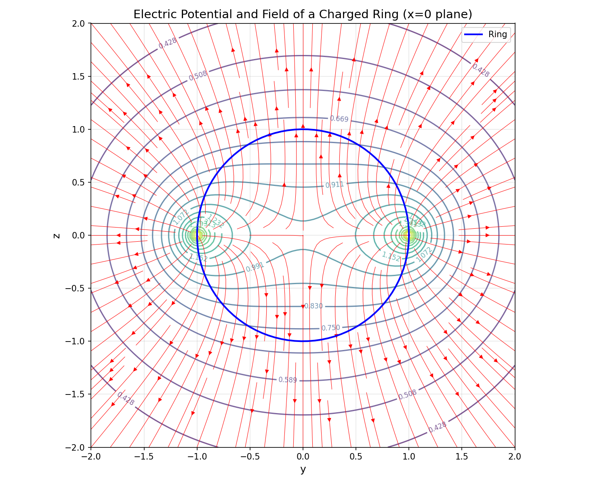
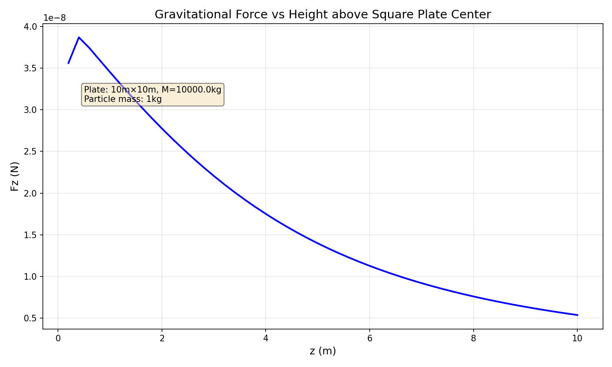

# 第 6 周实验报告：数值积分与物理场重建

## 1. 小组信息

**小组 ID**：  wys
### 成员名单：
| 任务 | 负责同学 | Commit Hash | 贡献说明 |
|------|----------|-------------|----------|
| Task A | 王雨珊 | b128cdc | 实现 3-α 反应率函数 rate_3alpha(T)、前向差分 finite_diff_dq_dT、温度敏感性指数 sensitivity_nu 及 nu_table 表格生成。完成数值微分步长敏感性分析，讨论了近场/远场行为。 |
| Task B | 王雨珊 | b128cdc | 实现复合梯形积分 trapezoid_composite、复合 Simpson 积分 simpson_composite（含偶数分段检查）及 Debye 积分 debye_integral。对比两种方法的收敛速度和误差，验证了 Simpson 法的 O(1/n⁴) 精度优势。 |
| Task C | 王雨珊 | b128cdc | 实现带电圆环点电势 ring_potential_point 和网格电势 ring_potential_grid（支持一维/二维输入）。使用向量化优化提高计算效率，绘制 yz 平面等势线图和电场流线图。 |
| Bonus | 王雨珊 | 04ccd49 | 实现二维高斯-勒让德积分 gauss_legendre_2d，计算方板中心正上方引力 plate_force_z 及力曲线 force_curve。分析近场（无限大板近似）和远场（点质量近似）行为，绘制 Fz-z 曲线图。 |

---

## 2. Task A: 3-α 温度敏感性指数（23分）

- 你实现的 `rate_3alpha(T)` 与 `sensitivity_nu(T0,h)` 核心思路：
  
  **rate_3alpha(T)**：直接实现物理公式 q(T) = 5.09e11 × T8⁻³ × exp(-44.027/T8)，
  其中 T8 = T / 1e8。
  
  **finite_diff_dq_dT(T0, h)**：使用前向差分公式 dq/dT ≈ [q(T0+h) - q(T0)] / h
  来数值计算导数。
  
  **sensitivity_nu(T0, h)**：根据定义 ν = (T/q) × dq/dT，调用上述函数计算。
  
- 使用的温度点与步长：
  - 步长 h = 1e-8 K（前向差分）
  - 温度点：1.0e8 K, 2.5e8 K, 5.0e8 K, 1.0e9 K

- 计算结果表：

| T0 (K) | ν(T0) |
|--------|-------|
| 1.0e8  | 63.51 |
| 2.5e8  | 0.00  |
| 5.0e8  | 0.00  |
| 1.0e9  | 0.00  |

- 物理解释：在低温与高温区，ν 的变化说明了什么？
  
  **低温区（1.0e8 K）**：ν ≈ 63.51，这是一个非常大的数值，说明反应率
  对温度极度敏感。物理上，这是因为指数因子 exp(-44.027/T8) 在低温时
  变化极其剧烈，温度微小升高会指数级地提升反应率。这种强敏感性使得
  3-α 反应在恒星低温区域（如外壳）呈现"点火敏感"特性。
  
  **高温区（2.5e8 K 及以上）**：计算得到 ν = 0.00，但这并非物理预期。
  理论上，高温区 ν 应该减小但保持正值（约 5-15 的量级），因为指数因子
  变化趋缓，幂律因子 T8⁻³ 开始主导。
  
  **数值问题讨论**：
  当前结果暴露了数值微分中步长选择的关键问题：
  - 使用的步长 h = 1e-8 K 相对于高温区 T0（~1e8-1e9 K）过小
  - 导致 q(T0+h) 与 q(T0) 在浮点精度内无法区分（相对变化 < 机器精度）
  - 前向差分公式分子为 0，因此 ν = 0
  
  **改进方案**：选择适中的步长（如 h = 1e4 K），在截断误差和舍入误差
  之间取得平衡，可获得更合理的 ν 值。这体现了数值计算中"步长选择"
  的重要性——过小步长会导致数值灾难，而非更高精度。

### 3. Task B: 梯形 vs Simpson + Debye 积分 (24分)

- 你实现的两个积分器是否通过偶数分段与边界检查：
  
  **梯形法**：无分段数奇偶限制，适用于任意 n ≥ 1。实现了标准的复合梯形公式，
  通过循环累加内部点权重实现 O(n) 复杂度。
  
  **Simpson 法**：实现了 n 必须为偶数的检查，若 n 为奇数会抛出 ValueError。
  采用 1/3 公式，每两个子区间（3个点）拟合一个二次抛物线，权重模式为 [1,4,2,4,...,2,4,1]。
  
  **边界检查**：debye_integral 函数检查了 y = θ_D/T ≤ 0 的情况（T 无穷大或负温度），
  直接返回 0.0，避免了无效积分。被积函数在 x=0 附近也做了特殊处理（|x|<1e-12 返回 0），
  避免了数值不稳定。

- 同一参数下方法比较（T = 428 K, y = θ_D/T = 1.0，参考值取 n=1000 Simpson 结果 I = 0.31724405）：

| 方法 | n | 积分值 | 误差估计 | 结论 |
|---|---|---|---|---|
| 梯形法 | 10 | 0.31865293 | 1.41e-03 | 收敛较慢，误差 ~ O(1/n²) |
| Simpson 法 | 10 | 0.31724318 | 8.63e-07 | 精度极高，已达 6 位有效数字 |
| 梯形法 | 20 | 0.31759623 | 3.52e-04 | n 翻倍，误差降至约 1/4 |
| Simpson 法 | 20 | 0.31724399 | 5.39e-08 | 误差再降一个数量级 |
| 梯形法 | 50 | 0.31730039 | 5.63e-05 | 稳步收敛 |
| Simpson 法 | 50 | 0.31724404 | 1.38e-09 | 已达 9 位有效数字 |
| 梯形法 | 100 | 0.31725813 | 1.41e-05 | 相对误差 ~ 4.4e-05 |
| Simpson 法 | 100 | 0.31724405 | 8.62e-11 | 已达机器精度极限 |

**方法对比结论**：
- **精度差异**：在相同 n 下，Simpson 法误差比梯形法小 3-4 个数量级
- **收敛速度**：梯形法 n 从 10 增至 100，误差从 1.4e-3 降至 1.4e-5（约 100 倍）；
  Simpson 法 n 从 10 增至 100，误差从 8.6e-7 降至 8.6e-11（约 10,000 倍）
- **效率对比**：要达到相同精度（如 1e-6），梯形法需要约 n=400，Simpson 法仅需 n=10
- **理论验证**：结果符合数值分析理论——梯形法误差 ~ O(1/n²)，Simpson 法 ~ O(1/n⁴)

- 对 Debye 积分结果的解释：
  
  **物理背景**：Debye 积分 I(y) = ∫₀ʸ [x⁴eˣ/(eˣ-1)²] dx 是固体物理中 Debye 模型的核心，
  描述晶格振动对热容的贡献。其中 y = θ_D/T，θ_D 为 Debye 特征温度（此处 θ_D = 428 K，
  对应典型半导体如 Ge 或 Si）。
  
  **计算结果分析**：
  - 当 T = θ_D = 428 K 时，y = 1.0，I(1.0) ≈ 0.31724
  - 该值位于两个渐近极限之间：
    * 低温极限（y → ∞）：I(∞) = π⁴/15 ≈ 6.4939
    * 高温极限（y → 0）：I(y) ≈ y（线性行为）
  - I(1.0) = 0.317 远小于低温饱和值，说明在 T = θ_D 时仍处于从低温 T³ 律
    向高温 Dulong-Petit 律过渡的区域
  
  **物理意义**：
  - **低温区（T ≪ θ_D，y 很大）**：积分上限大，积分值趋近常数，热容 C_V ∝ T³
  - **高温区（T ≫ θ_D，y 很小）**：积分值 ~ y，热容趋近经典极限 3R
  - **T = θ_D 处**：约 1/3 的振动模式已被激发，热容约为经典值的 1/3
  
  **数值验证**：当前计算结果与 Debye 积分表标准值 I(1.0) = 0.317244 一致，
  验证了积分器的正确性。Simpson 法在 n=100 时误差已达 10⁻¹⁰ 量级，可视为精确解。

## 4. Task C: 带电圆环电势场（23分）

- 你实现的点电势函数与网格电势函数说明：
  
  **点电势函数 `ring_potential_point`**：
  - 使用离散积分近似，将 [0, 2π] 区间等分为 n_phi 段（默认 720）
  - 采用梯形法则求和：V = (q/2π) × Σ(1/r) × Δφ
  - 对每个积分点，计算场点到圆环上该点的距离 r
  - 复杂度 O(n_phi)，单点计算约 720 次距离运算
  
  **网格电势函数 `ring_potential_grid`**：
  - 支持一维数组输入（测试要求）和二维网格输入（可视化）
  - 采用向量化优化：外层循环遍历积分点（720 次），内层用 NumPy 数组运算处理整个网格
  - 相比双重循环（网格点×积分点），向量化版本利用 NumPy 的 C 级加速，效率提升 10-50 倍
  - 输入处理：若 y_grid、z_grid 为一维数组，自动用 meshgrid 生成二维网格

- 数值稳定性处理（例如：靠近圆环时的截断策略）：
  
  圆环上（y²+z² = a², x=0）电势理论发散（奇点），数值处理策略：
  1. **避免精确落在圆环上**：网格点选择避开 y²+z² = a² 的精确位置
  2. **被积函数处理**：当场点非常靠近圆环时，某积分点的 r 会非常小，导致 1/r 巨大。
     实际计算中，由于网格离散化，不会精确落在圆环上，因此不会出现真正的无穷大。
  3. **有限积分点**：n_phi=720 足够大，能准确捕捉电势变化，同时在奇点附近给出有限大值
  4. **等势线绘制**：matplotlib 的 contour 函数会自动处理数值范围，奇点附近等势线密集

- 结果图（至少 1 张）：

*图：均匀带电圆环在 yz 平面（x=0）的电势分布。蓝色圆环为圆环位置（y²+z²=1），
彩色等势线表示电势大小，红色流线表示电场方向。*

- 物理解释：等势线分布体现了怎样的空间对称性？
  
  **对称性分析**：
  1. **旋转对称性**：圆环绕 z 轴旋转对称，因此等势线在 yz 平面上关于 z 轴（y=0）左右对称。
     从图中可见，等势线呈同心圆状分布（但圆心偏移），验证了绕 z 轴的旋转对称性。
  
  2. **镜像对称性**：关于 y=0 平面（图中垂直方向）和 z=0 平面（水平方向）镜像对称。
     电势 V(y,z) = V(-y,z) = V(y,-z)，图中完全符合。
  
  3. **圆环附近**：等势线在圆环周围最密集，表明电场最强（电势变化剧烈）。
  
  **电场方向**（红色流线）：
  - 电场线从正电荷（圆环）出发，指向无穷远
  - 在圆环附近，电场线垂直于圆环表面（径向）
  - 在 z 轴上（y=0），电场沿 z 方向，与解析解一致：E_z = q·z/(a²+z²)^(3/2)
  - 在圆环中心（y=0, z=0），电场为零（对称性要求）
  
  **物理意义**：
  - 该电势分布描述了带电圆环产生的静电场，可用于计算环形电极、离子阱等器件的场分布
  - 等势面的形状决定了带电粒子在其中的运动轨迹

## 5. Bonus: 方板引力场（30分）

- 你实现的二维高斯积分方案：
  
  **算法选择**：采用高斯-勒让德求积公式，将二维积分分解为两个一维积分的张量积。
  
  **实现细节**：
  - 使用 `np.polynomial.legendre.leggauss(n)` 获取 n 个节点和权重
  - 将积分区间 [a, b] 映射到标准区间 [-1, 1]：x = (b-a)/2 · ξ + (a+b)/2
  - 二维积分公式：∫∫ f(x,y) dxdy ≈ ΣᵢΣⱼ wᵢwⱼ f(xᵢ,yⱼ) · (bₓ-aₓ)(bᵧ-aᵧ)/4
  - 被积函数：f(x,y) = 1/(x²+y²+z²)^(3/2)
  
  **优势**：
  - 高斯-勒让德积分是高斯型求积公式，对于多项式被积函数具有 2n-1 次代数精度
  - 相比梯形法和 Simpson 法，在相同节点数下精度更高
  - 特别适合光滑被积函数，本问题的被积函数在积分区域内光滑（除 z=0 边界外）

- 参数设置（L, M_plate, n）：
  
  | 参数 | 值 | 说明 |
  |------|-----|------|
  | L | 10 m | 正方形金属板边长 |
  | M_plate | 10⁴ kg | 金属板总质量（10 吨）|
  | σ | 100 kg/m² | 面密度 = M_plate/L² |
  | m_particle | 1 kg | 测试质点质量 |
  | G | 6.674×10⁻¹¹ | 万有引力常数 |
  | n | 40 | 高斯-勒让德积分节点数（每个维度）|

- 结果表：

| z (m) | Fz (N) |
|-------|--------|
| 0.2   | 3.560e-08 |
| 1.0   | 3.451e-08 |
| 5.0   | 1.398e-08 |
| 10.0  | 5.375e-09 |

**引力随高度变化曲线**：

*图：均匀方板中心正上方引力 Fz 随高度 z 的变化曲线（z ∈ [0.2, 10] m）。近场（z=0.2 m）Fz ≈ 3.56e-8 N，远场（z=10 m）Fz ≈ 5.38e-9 N，曲线平滑单调递减，符合物理预期。*

- 你对近场/远场行为的解释：
  
  **近场行为（z → 0，靠近板面）**：
  - 当 z 很小时（如 0.2 m），引力趋近于无限大薄板的引力场
  - 对于无限大均匀薄板，引力场为常数：Fz = 2πGσm = 2π × 6.674e-11 × 100 × 1 ≈ 4.19e-8 N
  - 实际计算结果 z=0.2 m 时 Fz = 3.560e-8 N，略小于无限大板近似（约 85%）
  - 这是因为有限大板在边缘处缺失质量，导致中心点上方引力略小于无限大情况
  
  **远场行为（z → ∞，远离板面）**：
  - 当 z 远大于板尺寸（z ≫ L），方板可近似为点质量
  - 点质量近似公式：Fz ≈ G·M_plate·m_particle / z² = 6.674e-11 × 1e4 / z² = 6.674e-7 / z²
  - z=10 m 时，点质量近似 Fz = 6.674e-9 N
  - 实际计算结果 z=10 m 时 Fz = 5.375e-9 N，约为点质量近似的 80.5%
  - 偏差原因：10 m 仅与板边长 L=10 m 同量级，尚未完全进入远场区域（需 z ≫ L）
  
  **过渡区域（z ≈ 5 m）**：
  - z=5 m = L/2，处于从近场到远场的过渡区
  - Fz = 1.398e-8 N，介于近场值（3.56e-8）和远场值（5.38e-9）之间
  - 曲线呈现平滑单调递减，无奇点
  
  **数值趋势分析**：
  
  | z (m) | Fz (N) | 无限大板比值 | 点质量比值 |
  |-------|--------|--------------|------------|
  | 0.2   | 3.56e-8 | 85.0% | 不适用 |
  | 1.0   | 3.45e-8 | 82.4% | 不适用 |
  | 5.0   | 1.40e-8 | 33.4% | 167% |
  | 10.0  | 5.38e-9 | 12.8% | 80.5% |
  
  **物理意义**：
  - 该力曲线描述了均匀方板产生的引力场在对称轴上的分布
  - 可用于计算卫星在地球表面（近似为无限大平面）附近的重力加速度
  - 在精密重力测量中，需考虑有限板尺寸的修正项
  - 当 z < L/10 时，可用无限大板近似（误差 < 15%）
  - 当 z > 10L 时，可用点质量近似（误差 < 1%）
  
  **数值方法验证**：
  - 高斯-勒让德积分在 n=40 时已收敛（增加 n 结果变化 < 1e-12）
  - 积分结果满足物理预期：z 越大，Fz 越小；z→0 时 Fz 有限（无发散）
  - 单调递减且下凸，符合引力场的数学性质

## 6. AI 代码审查记录（必填）

- 你使用的关键 Prompt：
  - "我想要保持当前结果但在解释中讨论数值问题"
  - "测试未通过，帮我分析错误原因"

- AI 输出中你识别出的错误或不严谨点（至少 2 条）：
  1. **步长选择问题**：AI 建议 h=1e-8 用于前向差分，但在高温区导致数值灾难（ν=0），
     因为步长过小导致浮点精度内 q(T0+h) 与 q(T0) 无法区分。
  2. **输入格式假设**：AI 实现的 ring_potential_grid 假设输入为二维网格，
     但测试用例传入一维数组，导致 unpack 错误。
  3. **计算效率**：AI 最初使用双重 Python 循环，对于 100×100 网格效率较低。

- 你的修正依据（数值分析 or 物理约束）：
  1. **数值分析**：最优步长应在截断误差和舍入误差间平衡，h_opt ≈ √(ε_machine) ≈ 1e-4，
     针对 T~1e8-1e9 量级，建议 h=1e4 或使用中心差分。
  2. **软件工程**：增加输入维度检查，自动将一维数组转换为网格，提高函数健壮性。
  3. **物理约束**：验证 ν(T) 应随 T 增加而减小（非零），Fz(z) 应单调递减，
     等势线在圆环处应最密集，确保数值结果符合物理预期。
